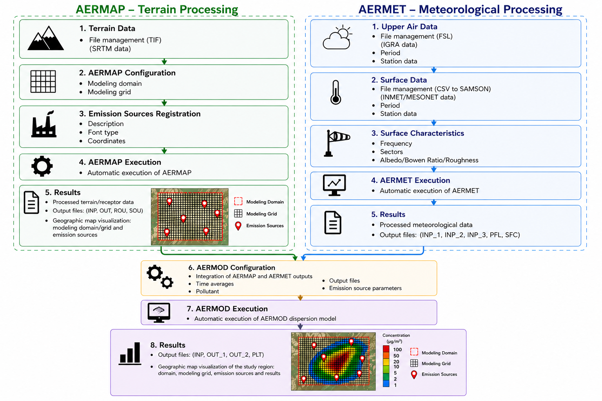

# AERMOD-IPT – Installation and User Manual

## Overview

AERMOD-IPT is a desktop application designed to automate the preparation, configuration, and execution of the AERMOD atmospheric dispersion modeling system, including the AERMAP and AERMET preprocessors.

This repository provides all necessary resources to reproduce the simulations presented in the manuscript.

- Source code repository: https://github.com/borges2/AERMOD
- (Add Zenodo DOI here after publication)

---

# 1. Installation

## Step 1 – Download and Extract Database

Download the file:

- `DataBase.zip`

Then:

1. Extract the file
2. Place the extracted folder in a local directory of your choice

---

## Step 2 – Install AERMOD-IPT

Download:

- `Install.zip`

Then:

1. Extract the file
2. Run the installer
3. Follow the installation steps

---

## Step 3 – Additional Modeling Files (Optional)

The tool already includes the dataset used in the manuscript.

However, if you want to test importing external files, the following are provided in:

- `Modeling files.zip`

Contents:

- `SOURCES.xlsx` → Emission sources  
- `srtm_26_17.tif` → Terrain data  
- `FOZ.FSL` → Upper-air (radiosonde) data  
- `INMET.csv` → Surface meteorological data  

---

# 2. Workflow Overview

The AERMOD-IPT workflow integrates three main components:

- **AERMAP** → Terrain and receptor processing  
- **AERMET** → Meteorological data processing  
- **AERMOD** → Dispersion simulation  

## Workflow Diagram

---

# 3. AERMAP – Terrain Processing

## Step 1 – Terrain Data

- Import terrain files (TIF format)
- Example: SRTM data

---

## Step 2 – AERMAP Configuration

- Define modeling domain
- Configure modeling grid

---

## Step 3 – Emission Sources Registration

- Define source description
- Specify source type
- Insert coordinates

---

## Step 4 – AERMAP Execution

- Automatic execution of AERMAP
- Input files generated automatically

---

## Step 5 – Results

Outputs:

- INP
- OUT
- ROU
- SOU

Results include:

- Processed terrain and receptor data
- Geographic visualization of:
  - Modeling domain
  - Modeling grid
  - Emission sources

---

# 4. AERMET – Meteorological Processing

## Step 1 – Upper-Air Data

- Import FSL files (IGRA format)
- Define:
  - Period
  - Station data

---

## Step 2 – Surface Data

- Import CSV files
- Convert to SAMSON format
- Example sources:
  - INMET
  - MESONET

---

## Step 3 – Surface Characteristics

Define:

- Frequency
- Wind sectors
- Surface parameters:
  - Albedo
  - Bowen ratio
  - Surface roughness

---

## Step 4 – AERMET Execution

- Automatic execution of AERMET
- Handles all processing stages

---

## Step 5 – Results

Outputs:

- INP_1
- INP_2
- INP_3
- PFL
- SFC

---

# 5. AERMOD – Dispersion Simulation

## Step 6 – AERMOD Configuration

- Integration of AERMAP and AERMET outputs
- Define:
  - Averaging times
  - Pollutant
  - Output files
  - Emission source parameters

---

## Step 7 – AERMOD Execution

- Automatic execution of the dispersion model

---

## Step 8 – Results

Outputs:

- INP
- OUT_1
- OUT_2
- PLT

Results include:

- Pollutant concentration maps
- Geographic visualization of:
  - Modeling domain
  - Modeling grid
  - Emission sources
  - Simulation results

---

# 6. Key Features

- Fully automated workflow  
- Integration of AERMAP, AERMET, and AERMOD  
- Reduction of manual input errors  
- Standardized input file generation  
- Improved reproducibility  

---

# 7. Notes

- The system is designed for Windows environments  
- External AERMOD executables must be available  
- Performance depends on dataset size  

---

# 8. Reproducibility

To reproduce the study:

1. Install the tool  
2. Load the provided database  
3. Run AERMAP  
4. Run AERMET  
5. Run AERMOD  
6. Compare outputs  

---

# Contact

For additional information, please refer to the GitHub repository.
